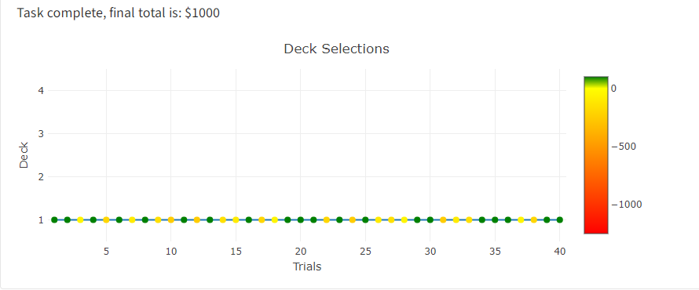

## Parameters of the Iowa Gambling Task

Congratulations on completing the IGT! Hopefully you were able to make some money during your attempt. At any point, you may navigate back to the *exploration* page to give it another try. 

To clarify, the graph that was produced throughout the trials was a running visualization of what was happening during your attempt. The :term[x-axis] presented the number of trials, while the :term[y-axis] denoted the deck selections that were made on each trial. Each of the dots on the graph produced are colored such that the shades of green represent the wins and the shades of yellow-red represent losses. 

## The Losers

You may have been able to detect that decks 1 & 2 produce a long-term loss, although initially they have large gains. Deck 1 has a mixture of gains and losses, where the losses are substantial but perhaps insignificant if undetected.

 Deck 2 produces long stretches of profit before presenting a significant loss on some of the trials.

## The Winners
Perhaps not as exciting, decks 3 & 4 produce a long-term profit. Deck 3 behaves almost like Deck 1, however the gains and losses aren't as significant.

Similarly, Deck 4 is almost a copy of Deck 2. It produces a profit with insignificant losses on some of the trials.

## Data

Below is a table where you can look into the setup of the model. Each deck on each trial will present the positive number as a gain and the negative number as a loss.

<table class="decks">
  <tr>
    <td class="text-center">&nbsp;</td>
    <th>Deck 1</th>
    <th>Deck 2</th>
    <th>Deck 3</th>
    <th>Deck 4</th>
  </tr>
  <tr>
    <td class="text-center">Trial 1</td>
    <td class="text-center">100</td>
    <td class="text-center">100</td>
    <td class="text-center">50</td>
    <td class="text-center">50</td>
  </tr>
   <tr>
    <td class="text-center">Trial 2</td>
    <td class="text-center">100</td>
    <td class="text-center">100</td>
    <td class="text-center">50</td>
    <td class="text-center">50</td>
  </tr>
   <tr>
    <td class="text-center">Trial 3</td>
    <td class="text-center">100, -150</td>
    <td class="text-center">100</td>
    <td class="text-center">50, -50</td>
    <td class="text-center">50</td>
  </tr>
   <tr>
    <td class="text-center">Trial 4</td>
    <td class="text-center">100</td>
    <td class="text-center">100</td>
    <td class="text-center">50</td>
    <td class="text-center">50</td>
  </tr>
   <tr>
    <td class="text-center">Trial 5</td>
    <td class="text-center">100, -300</td>
    <td class="text-center">100</td>
    <td class="text-center">50, -50</td>
    <td class="text-center">50</td>
  </tr>
   <tr>
    <td class="text-center">Trial 6</td>
    <td class="text-center">100</td>
    <td class="text-center">100</td>
    <td class="text-center">50</td>
    <td class="text-center">50</td>
  </tr>
   <tr>
    <td class="text-center">Trial 7</td>
    <td class="text-center">100, -200</td>
    <td class="text-center">100</td>
    <td class="text-center">50, -50</td>
    <td class="text-center">50</td>
  </tr>
   <tr>
    <td class="text-center">Trial 8</td>
    <td class="text-center">100</td>
    <td class="text-center">100</td>
    <td class="text-center">50</td>
    <td class="text-center">50</td>
  </tr>
   <tr>
    <td class="text-center">Trial 9</td>
    <td class="text-center">100, -250</td>
    <td class="text-center">100, -1250</td>
    <td class="text-center">50, -50</td>
    <td class="text-center">50</td>
  </tr>
   <tr>
    <td class="text-center">Trial 10</td>
    <td class="text-center">100, -350</td>
    <td class="text-center">100</td>
    <td class="text-center">50, -50</td>
    <td class="text-center">50, -250</td>
  </tr>
  <tr>
    <td class="text-center">Trial 11</td>
    <td class="text-center">100</td>
    <td class="text-center">100</td>
    <td class="text-center">50</td>
    <td class="text-center">50</td>
  </tr>
   <tr>
    <td class="text-center">Trial 12</td>
    <td class="text-center">100, -350</td>
    <td class="text-center">100</td>
    <td class="text-center">50, -25</td>
    <td class="text-center">50</td>
  </tr>
   <tr>
    <td class="text-center">Trial 13</td>
    <td class="text-center">100</td>
    <td class="text-center">100</td>
    <td class="text-center">50, -75</td>
    <td class="text-center">50</td>
  </tr>
   <tr>
    <td class="text-center">Trial 14</td>
    <td class="text-center">100, -250</td>
    <td class="text-center">100, -1250</td>
    <td class="text-center">50</td>
    <td class="text-center">50</td>
  </tr>
   <tr>
    <td class="text-center">Trial 15</td>
    <td class="text-center">100, -200</td>
    <td class="text-center">100</td>
    <td class="text-center">50</td>
    <td class="text-center">50</td>
  </tr>
   <tr>
    <td class="text-center">Trial 16</td>
    <td class="text-center">100</td>
    <td class="text-center">100</td>
    <td class="text-center">50</td>
    <td class="text-center">50</td>
  </tr>
   <tr>
    <td class="text-center">Trial 17</td>
    <td class="text-center">100, -300</td>
    <td class="text-center">100</td>
    <td class="text-center">50, -25</td>
    <td class="text-center">50</td>
  </tr>
   <tr>
    <td class="text-center">Trial 18</td>
    <td class="text-center">100, -150</td>
    <td class="text-center">100</td>
    <td class="text-center">50, -75</td>
    <td class="text-center">50</td>
  </tr> 
   <tr>
    <td class="text-center">Trial 19</td>
    <td class="text-center">100</td>
    <td class="text-center">100</td>
    <td class="text-center">50</td>
    <td class="text-center">50</td>
  </tr>
   <tr>
    <td class="text-center">Trial 20</td>
    <td class="text-center">100</td>
    <td class="text-center">100</td>
    <td class="text-center">50, -50</td>
    <td class="text-center">50, -250</td>
  </tr>
  <tr>
    <td class="text-center">Trial 21</td>
    <td class="text-center">100</td>
    <td class="text-center">100, -1250</td>
    <td class="text-center">50</td>
    <td class="text-center">50</td>
  </tr>
   <tr>
    <td class="text-center">Trial 22</td>
    <td class="text-center">100,-300</td>
    <td class="text-center">100</td>
    <td class="text-center">50</td>
    <td class="text-center">50</td>
  </tr>
   <tr>
    <td class="text-center">Trial 23</td>
    <td class="text-center">100</td>
    <td class="text-center">100</td>
    <td class="text-center">50</td>
    <td class="text-center">50</td>
  </tr>
   <tr>
    <td class="text-center">Trial 24</td>
    <td class="text-center">100, -350</td>
    <td class="text-center">100</td>
    <td class="text-center">50, -50</td>
    <td class="text-center">50</td>
  </tr>
   <tr>
    <td class="text-center">Trial 25</td>
    <td class="text-center">100</td>
    <td class="text-center">100</td>
    <td class="text-center">50, -25</td>
    <td class="text-center">50</td>
  </tr>
   <tr>
    <td class="text-center">Trial 26</td>
    <td class="text-center">100, -200</td>
    <td class="text-center">100</td>
    <td class="text-center">50, -50</td>
    <td class="text-center">50</td>
  </tr>
   <tr>
    <td class="text-center">Trial 27</td>
    <td class="text-center">100, -250</td>
    <td class="text-center">100</td>
    <td class="text-center">50</td>
    <td class="text-center">50</td>
  </tr>
   <tr>
    <td class="text-center">Trial 28</td>
    <td class="text-center">100, -150</td>
    <td class="text-center">100</td>
    <td class="text-center">50</td>
    <td class="text-center">50</td>
  </tr>
   <tr>
    <td class="text-center">Trial 29</td>
    <td class="text-center">100</td>
    <td class="text-center">100</td>
    <td class="text-center">50, -75</td>
    <td class="text-center">50, -250</td>
  </tr>
   <tr>
    <td class="text-center">Trial 30</td>
    <td class="text-center">100</td>
    <td class="text-center">100</td>
    <td class="text-center">50, -50</td>
    <td class="text-center">50</td>
  </tr>
   <tr>
    <td class="text-center">Trial 31</td>
    <td class="text-center">100, -350</td>
    <td class="text-center">100</td>
    <td class="text-center">50</td>
    <td class="text-center">50</td>
  </tr>
   <tr>
    <td class="text-center">Trial 32</td>
    <td class="text-center">100, -200</td>
    <td class="text-center">100, -1250</td>
    <td class="text-center">50</td>
    <td class="text-center">50</td>
  </tr>
   <tr>
    <td class="text-center">Trial 33</td>
    <td class="text-center">100, -250</td>
    <td class="text-center">100</td>
    <td class="text-center">50</td>
    <td class="text-center">50</td>
  </tr>
   <tr>
    <td class="text-center">Trial 34</td>
    <td class="text-center">100</td>
    <td class="text-center">100</td>
    <td class="text-center">50, -25</td>
    <td class="text-center">50</td>
  </tr>
  <tr>
    <td class="text-center">Trial 35</td>
    <td class="text-center">100</td>
    <td class="text-center">100</td>
    <td class="text-center">50, -25</td>
    <td class="text-center">50, -250</td>
  </tr>
   <tr>
    <td class="text-center">Trial 36</td>
    <td class="text-center">100</td>
    <td class="text-center">100</td>
    <td class="text-center">50</td>
    <td class="text-center">50</td>
  </tr>
   <tr>
    <td class="text-center">Trial 37</td>
    <td class="text-center">100, -150</td>
    <td class="text-center">100</td>
    <td class="text-center">50, -75</td>
    <td class="text-center">50</td>
  </tr>
   <tr>
    <td class="text-center">Trial 38</td>
    <td class="text-center">100, -300</td>
    <td class="text-center">100</td>
    <td class="text-center">50</td>
    <td class="text-center">50</td>
  </tr>
   <tr>
    <td class="text-center">Trial 39</td>
    <td class="text-center">100</td>
    <td class="text-center">100</td>
    <td class="text-center">50</td>
    <td class="text-center">50,-50</td>
  </tr>
   <tr>
    <td class="text-center">Trial 40</td>
    <td class="text-center">100</td>
    <td class="text-center">100</td>
    <td class="text-center">50</td>
    <td class="text-center">50,-75</td>
  </tr>
</table>

